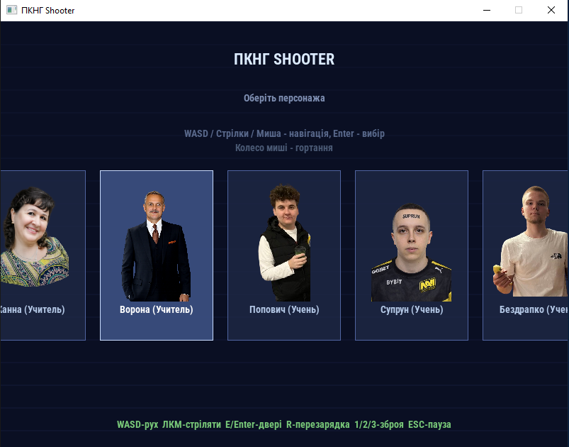
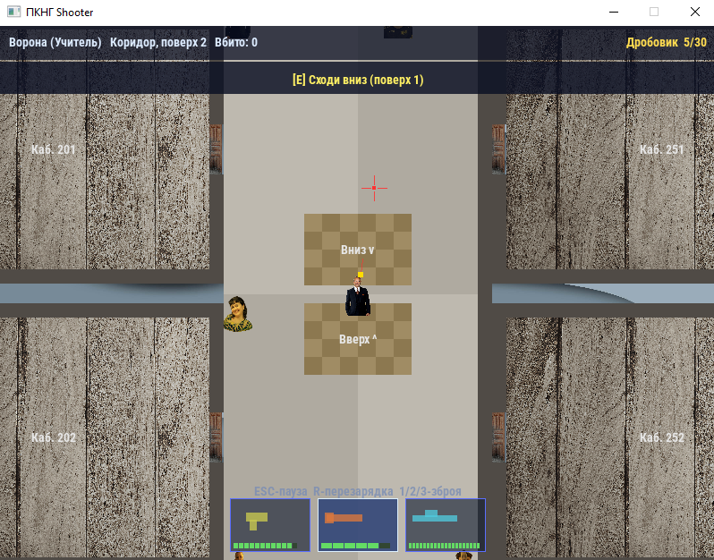

## 🎮 Про гру

PKNG RASSTREL — це 2D гра, створена на C++ з використанням SDL2.  
Проєкт поєднує динамічний геймплей, систему бою, дослідження локацій та власний візуальний стиль.

У грі реалізовано:
- систему пересування персонажа
- бойову механіку
- камеру та карти
- UI та систему HP
- текстури, анімації та звуки

Гра активно розробляється та поступово отримує новий контент і механіки.

